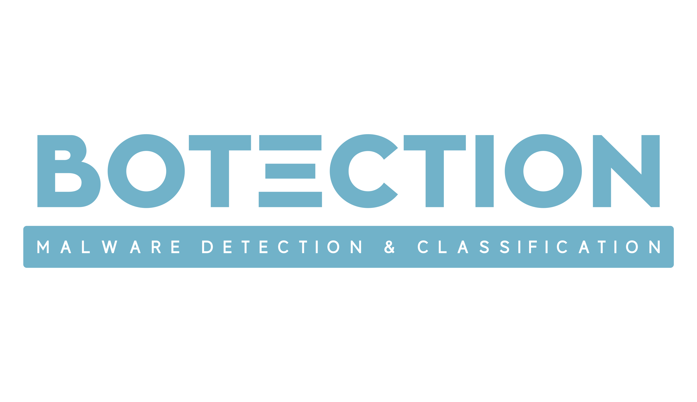
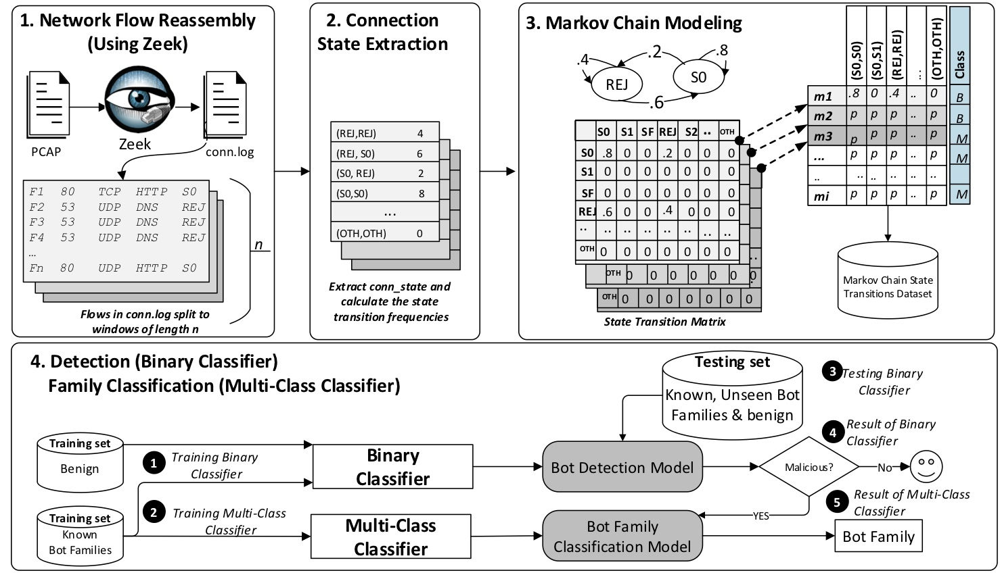

# BOTection
 Bot Detection by Building Markov Chain Models of Bots Network Behavior




BOTection is a privacy-preserving bot detection system that models the bot network flow behavior as a Markov Chain. Using the state transitions extracted from the Markov chains, we train a Random Forest classifier to first detect network flows produced by bots, and then identify their bot families.
BOTection is content-agnostic and resilient to encryption, relying on high-level network features to model bots' network behavior.  We evaluate our system on a dataset of over 7M malicious flows from 12 botnet families, showing its capability of detecting bots' network traffic with 99.78% F-measure. Notably, due to the modeling of general bot network behavior, BOTection can detect traffic belonging to unseen bot families with an F-measure of 93.03%. BOTection is also robust in classifying a bot family with a 99.09% F-measure score, which is essential in understanding their behavior for effective detection.



## About
This repository contains the code for the paper "[BOTection:  Bot Detection by Building Markov Chain Models of Bots' Network Behavior](https://seclab.bu.edu/people/gianluca/papers/botection-asiaccs2020.pdf)" to Appear in the [15th ACM ASIA Conference on Computer and Communications Security (ACM AsiaCCS'20)](https://asiaccs2020.cs.nthu.edu.tw).


### Prerequisites
In order to convert the PCAPs to Bro/Zeek logs, make sure to install [Zeek/Bro](https://docs.zeek.org/en/current/install/install.html)

## Dataset
In our paper, we used the following datasets:
* [Stratosphere IPS](https://www.stratosphereips.org/datasets-overview)
* [CTU-13](https://www.stratosphereips.org/datasets-ctu13)
* [ISCX Botnet 2014 Dataset](https://www.unb.ca/cic/datasets/botnet.html)

## How to run the code

You can run this code on a python/anaconda environment. 
 - **Read the [paper](https://seclab.bu.edu/people/gianluca/papers/botection-asiaccs2020.pdf)**, to understand how the system works.
 - The code is split according to the system modules, described in the paper: 
      * [Network Flow Reassembly](https://github.com/balahmadi-Ox/BOTection/blob/master/final_code/1_ConvertBro.py) 
      * [Connection State Extraction](https://github.com/balahmadi-Ox/BOTection/blob/master/final_code/2_State_Extraction.py)
      * [Markov Chain Modeling](https://github.com/balahmadi-Ox/BOTection/blob/master/final_code/3_MM_state_transition_Matrix.py)
      * [Detection (Binary Classifier)](https://github.com/balahmadi-Ox/BOTection/blob/master/final_code/4_Binary_Classifier.py)
      * [Family Classification (Multi-Class Classifier)](https://github.com/balahmadi-Ox/BOTection/blob/master/final_code/5_MultiClass_Classifier.py)
 - Add your PCAPs (dataset) to the PCAP sub-folder in Data - benign samples in Benign sub-folder, malicious in Malicious sub-folder, mix traffic in Mixed subfolder
 - You need to execute each module individually in order.

## Citation
If you use this repository please cite the paper as follows:
```
@inproceedings{balahmadi_botection,
author = {AlAhmadi, Bushra A. and Mariconti, Enrico and Spolaor, Riccardo and Stringhini, Gianluca and Martinovic, Ivan},
title = {BOTection: Bot Detection by Building Markov Chain Models of Bots Network Behavior},
year = {2020},
publisher = {Association for Computing Machinery},
booktitle = {Proceedings of the 15th ACM Asia Conference on Computer and Communications Security},
pages = {652–664},
numpages = {13},
location = {Taipei, Taiwan},
series = {ASIA CCS '20}
}

```
